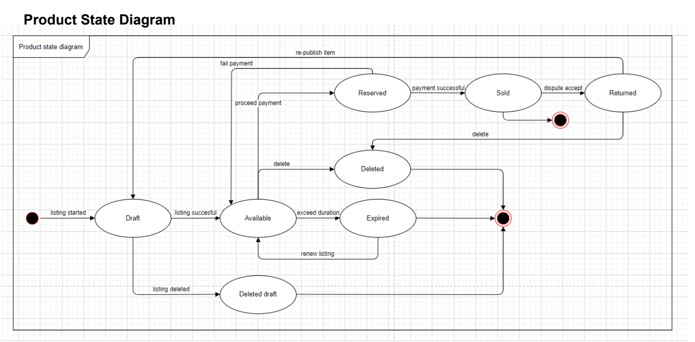
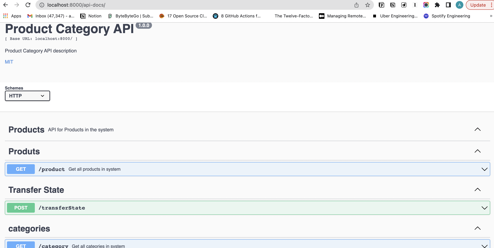
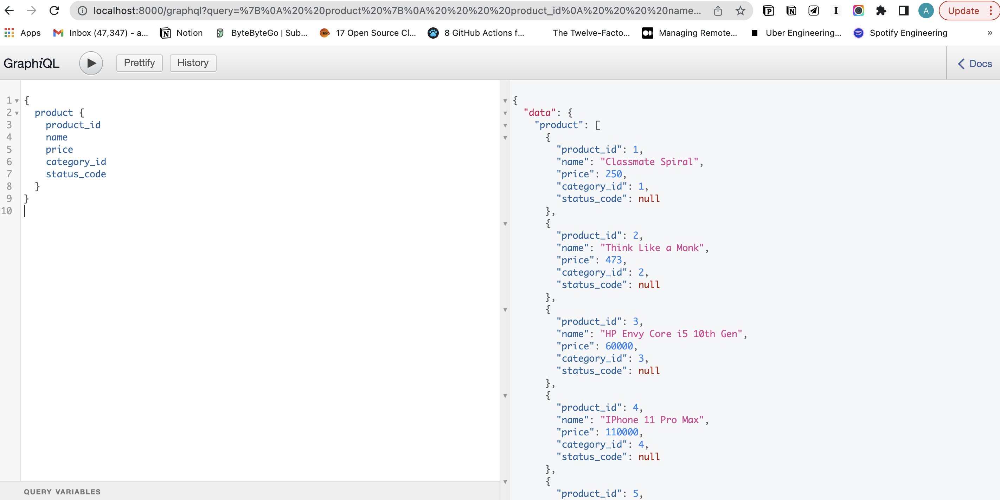

# product-category-api
Its objective is to provide product search and category detail api that provides product and category details



## Requirements:

1. Document APIs on Swagger.
   a. REST API and a GraphQL API to GET category list. If the parent_id is given it
   should return only the child categories
   b. REST API and a GraphQL API to get a list of products by state and transfer the
   state.
2. Design a proper class structure for handling the product state changes. You may use a
   matching design pattern (e.g. State Design Pattern). Proper exceptions should be thrown
   if there is an attempt to make invalid states. (e.g. draftProduct->sold() should not be
   allowed)
3. Implement unit testing for above APIs
4. Develop the REST and GraphQL APIs for above.

## Tech used:

**Runtime environment**

- [x] Node.js

**Programming Lnguage**

- [x] JavaScript

**Dependencies**

- [x]  "express": "^4.17.1"
- [x]  "lodash": "^4.17.19"
- [x] "body-parser": "^1.18.2"
- [x] "winston": "^3.1.0"
- [x]  "winston-transport": "^4.2.0",
- [x] "boom": "^7.1.1"
- [x] "@hapi/joi": "^17.1.1",
- [x] "@joi/date": "^2.1.0",
- [x] "swagger-ui-express": "^4.1.4",
- [x] "express-graphql": "^0.8.0",
- [x] "graphql": "^14.2.1"

## How to install & run:

### Using Git (recommended)

1. Navigate & open CLI into the directory where you want to put this project & Clone this project using this command.

```bash
git clone https://github.com/anilkushwahammt/product-category-api.git
```

### Using manual download ZIP

1. Download repository
2. Extract the zip file, navigate into it & copy the folder to your desired directory

### Install npm dependencies after cloning or downloading

```bash
cd product-category-api
npm install
```

### Setting up environments

1. There is a file named `.env` on the root directory of the project. Set below details accordingly

   ```
   PORT=8080
   LOG_LEVEL=error
   ```

### Run the project

```bash
npm start
```

You can be sure that the server is running by checking this output in the command window

```bash
> product-category-api@1.0.0 start
> node app

server running at port 8000...
```

In Browser Type

```
http://localhost:8000/
product category api is up and running...
```

Press `CTRL + C` to stop the server.

### Run Test cases 

```bash
npm test
```

You can be sure that all test cases should pass

```
 15 passing (65ms)
```

### View Swagger UI

```bash
http://localhost:8000/api-docs/
```



### View GraphQL API

```bash
http://localhost:8000/graphql
```


